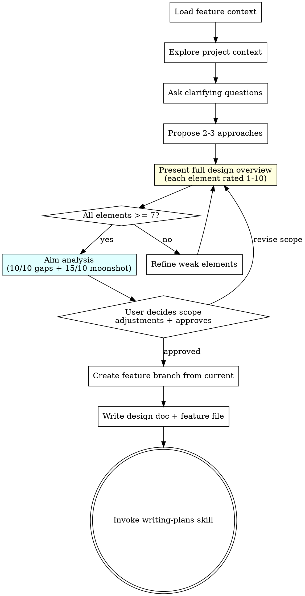

# Brainstorming Ideas Into Designs

## Overview

Help turn ideas into fully formed designs and specs through natural collaborative dialogue.

Start by understanding the current project context, then ask questions one at a time to refine the idea. Once you understand what you're building, present the design and get user approval.

<HARD-GATE>
Do NOT invoke any implementation skill, write any code, scaffold any project, or take any implementation action until you have presented a design and the user has approved it. This applies to EVERY project regardless of perceived simplicity.
</HARD-GATE>

## Anti-Pattern: "This Is Too Simple To Need A Design"

Every project goes through this process. A todo list, a single-function utility, a config change — all of them. "Simple" projects are where unexamined assumptions cause the most wasted work. The design can be short (a few sentences for truly simple projects), but you MUST present it and get approval.

## Checklist

You MUST create a task for each of these items and complete them in order:

1. **Load feature context** — use `feature-context` skill, read existing feature file or note that one needs creating
2. **Explore project context** — check files, docs, recent commits
3. **Ask clarifying questions** — one at a time, understand purpose/constraints/success criteria
4. **Propose 2-3 approaches** — with trade-offs and your recommendation
5. **Present full design overview** — complete picture with every element rated 1-10 (confidence/clarity), MUST include Acceptance Scenarios (Given/When/Then) or explicit N/A
6. **Refine weak elements** — anything rated below 7 gets discussed until raised or consciously accepted
7. **Aim analysis (automatic)** — after all elements >= 7, automatically run `/aim 10` then `/aim 15`. User decides scope adjustments before approval.
8. **Create feature branch + write docs** — create `feature/<name>` branch from current branch, save design to `docs/plans/YYYY-MM-DD-<topic>-design.md`, create `.ai/features/<name>.md` with `status: planned`, plan path, and `branch:` field, commit both
9. **Transition to implementation** — invoke writing-plans skill to create implementation plan

## Process Flow



**The terminal state is invoking writing-plans.** Do NOT invoke frontend-design, mcp-builder, or any other implementation skill. The ONLY skill you invoke after brainstorming is writing-plans.

## Step 0: Load Feature Context (REQUIRED)

Before starting brainstorming:
1. Use `feature-context` skill to check existing feature files for this branch
2. If feature file exists — read it, understand status and dependencies
3. If no feature file — you'll create one in step 6

## Branch Creation (Step 7)

After design is approved, before writing docs:

```bash
# Create feature branch from current branch
git checkout -b feature/<feature-name>
```

- Branch name: `feature/<short-descriptive-name>` (e.g. `feature/user-management-v2`)
- Base: always current branch (could be `main`, could be another feature branch)
- Record base branch in feature file frontmatter: `base_branch: <current-branch>`
- This enables branch chaining: `main → feature/A → feature/B`

Then write design doc + feature file on the new branch and commit.

## The Process

**Understanding the idea:**
- Check out the current project state first (files, docs, recent commits)
- Ask questions one at a time to refine the idea
- Prefer multiple choice questions when possible, but open-ended is fine too
- Only one question per message - if a topic needs more exploration, break it into multiple questions
- Focus on understanding: purpose, constraints, success criteria

**Exploring approaches:**
- Propose 2-3 different approaches with trade-offs
- Lead with your recommended option and explain why
- **Educational context is REQUIRED** — each approach must explain:
  - WHY this pattern exists (what problem in the industry created it)
  - WHEN it shines vs when it's overkill (real-world scenarios)
  - What architectural principle it leverages (e.g. SRP, CQRS, event sourcing)
  - Trade-offs: what you gain vs what you pay (complexity, performance, maintainability)
- The user should learn something new from reading the options — even if they already know which one to pick
- Do NOT present code snippets at this stage — focus on concepts, mental models, and reasoning

**Presenting the full design overview:**
- Once approach is chosen, present the COMPLETE design as one cohesive document
- Every element gets a confidence rating 1-10:

```
DESIGN OVERVIEW
═══════════════

| # | Element | Description | Rating | Notes |
|---|---------|-------------|:------:|-------|
| 1 | Architecture | Driver pattern for booking panels | 9/10 | Well understood |
| 2 | Data model | New kwhotel_room_group_id on RoomType | 8/10 | Simple addition |
| 3 | Migration strategy | Seed Settings per tenant | 6/10 | Need to clarify rollback |
| 4 | Error handling | Pre-send validation | 7/10 | Edge cases TBD |
| 5 | Testing approach | Unit + integration | 7/10 | Factories, markers |
| 6 | Acceptance Scenarios | Given/When/Then E2E scenarios | 8/10 | SC-01..SC-03 |
| 7 | Operational Changes | Post-deploy ops files needed? | 9/10 | enable_jobs after deploy |
```

- **Rating meaning:** 1 = no idea how, 5 = rough sketch, 7 = solid plan, 10 = trivial/proven
- **Anything below 7** must be discussed and either raised or consciously accepted with rationale
- **Acceptance Scenarios is MANDATORY.** Empty = rating 0/10. For backend-only features (CLI, Celery, migration): use `N/A` with justification.
- **Operational Changes is MANDATORY.** Does this feature need post-deploy actions? (enable/disable jobs, seed settings, run SQL, change configuration). If YES — describe what ops files are needed. If NO — use `N/A: no post-deploy configuration changes required` with justification.
- User sees the full picture BEFORE approving — no section-by-section drip
- After user reviews ratings, refine weak elements together
- Re-present updated overview until user approves the whole

### Acceptance Scenarios (required in design overview)

Given/When/Then E2E scenarios. Become E2E tasks in the implementation plan.

Minimum: 1-2 atomic per feature. Journey only if ≥3 atomic. Backend-only: N/A with justification.

- **Atomic (SC-XX):** single action → single verification. E.g. `SC-01: Admin creates tenant — Given logged in, When fill form + save, Then toast + visible in list`
- **Journey:** chain ≥3 atomic scenarios. E.g. `SC-04: Full lifecycle — create (SC-01) → edit (SC-02) → delete (SC-03) → verify gone`

## Key Principles

- **One question at a time** - Don't overwhelm with multiple questions
- **Multiple choice preferred** - Easier to answer than open-ended when possible
- **YAGNI ruthlessly** - Remove unnecessary features from all designs
- **Explore alternatives** - Always propose 2-3 approaches before settling
- **Incremental validation** - Present design, get approval before moving on
- **Be flexible** - Go back and clarify when something doesn't make sense
- **One feature = one branch** - Always create a feature branch, never work directly on base
