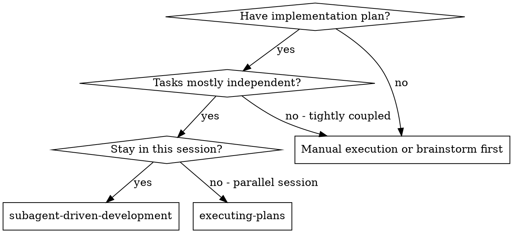
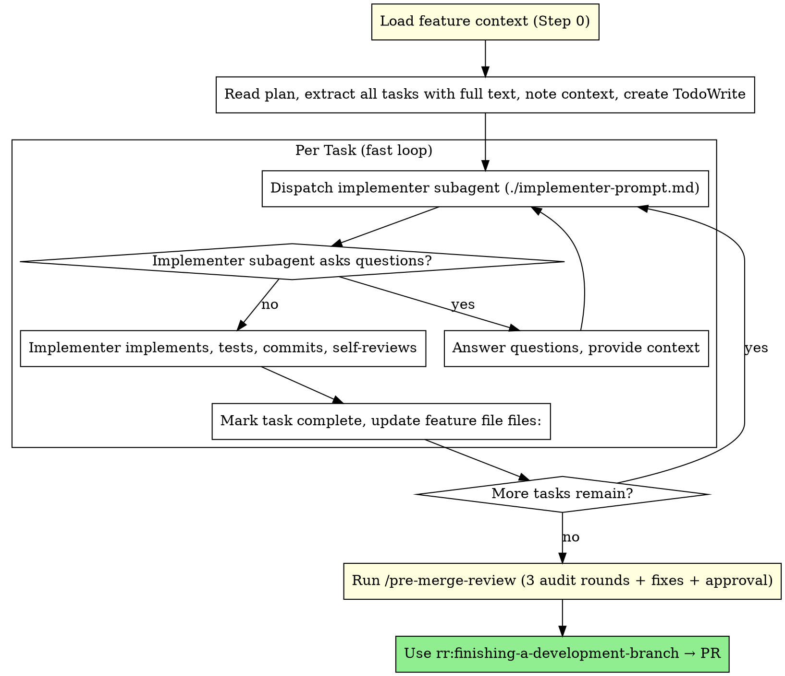

# Subagent-Driven Development

Execute plan by dispatching fresh subagent per task. Reviews happen at the end (audit + PR), not after each task.

**Core principle:** Fresh subagent per task + self-review = fast iteration. Quality pre-merge-reviews at the end via audit + PR.

## When to Use



**vs. Executing Plans (parallel session):**
- Same session (no context switch)
- Fresh subagent per task (no context pollution)
- Faster iteration (no human-in-loop between tasks)
- Reviews at the end (audit + PR), not per task

## The Process

### Step 0: Load Feature Context (REQUIRED)

Before anything else:
1. Use `feature-context` skill to find and read the active feature file for this branch
2. Read the feature file content — understand status, blocked_by, plans
3. This step is NON-NEGOTIABLE — even after context restore

### Execution Flow



## Prompt Templates

- `./implementer-prompt.md` - Dispatch implementer subagent

## Example Workflow

```
You: I'm using Subagent-Driven Development to execute this plan.

[Read plan file once: docs/plans/feature-plan.md]
[Extract all 5 tasks with full text and context]
[Create TodoWrite with all tasks]

Task 1: Hook installation script

[Dispatch implementer subagent with full task text + context]
Implementer: "Before I begin - should the hook be installed at user or system level?"
You: "User level (~/.config/rr/hooks/)"
Implementer:
  - Implemented install-hook command
  - Added tests, 5/5 passing
  - Self-review: Found I missed --force flag, added it
  - Committed
[Mark Task 1 complete, update feature file files:]

Task 2: Recovery modes

[Dispatch implementer subagent]
Implementer:
  - Added verify/repair modes
  - 8/8 tests passing
  - Self-review: All good
  - Committed
[Mark Task 2 complete, update feature file files:]

... (continue for all tasks)

[After all tasks]
[Run /pre-merge-review — 3 audit rounds with fixes + approval]
[Use rr:finishing-a-development-branch → PR]

Done!
```

## Advantages

**vs. Manual execution:**
- Subagents follow TDD naturally
- Fresh context per task (no confusion)
- Parallel-safe (subagents don't interfere)
- Subagent can ask questions (before AND during work)

**vs. Executing Plans:**
- Same session (no handoff)
- Continuous progress (no waiting)
- Fast task loop (no per-task review overhead)

**Efficiency gains:**
- No file reading overhead (controller provides full text)
- Controller curates exactly what context is needed
- Subagent gets complete information upfront
- Questions surfaced before work begins (not after)
- No reviewer subagents per task — saves ~2 agent invocations per task

**Quality pre-merge-reviews (at the end):**
- Self-review per task catches obvious issues during implementation
- `/pre-merge-review` runs 3 audit rounds (6 auditors incl. Diogenes for simplification), fixes between rounds, requires user approval
- PR creation provides final integration checkpoint

## Red Flags

**Never:**
- Start implementation on main/master branch without explicit user consent
- Dispatch multiple implementation subagents in parallel (conflicts)
- Make subagent read plan file (provide full text instead)
- Skip scene-setting context (subagent needs to understand where task fits)
- Ignore subagent questions (answer before letting them proceed)
- Skip `/pre-merge-review` at the end — it's the primary quality pre-merge-review
- Create PR without passing pre-merge-review

**If subagent asks questions:**
- Answer clearly and completely
- Provide additional context if needed
- Don't rush them into implementation

**If subagent fails task:**
- Dispatch fix subagent with specific instructions
- Don't try to fix manually (context pollution)

**If pre-merge-review finds persistent issues after 3 rounds:**
- Address them before creating PR
- Re-run `/pre-merge-review` if needed

## Per-Task Feature File Update

After each task is marked complete, update the feature file `files:` field with files created or significantly modified by that task. This ensures `/audit` (called by `/pre-merge-review`) can scope its review properly instead of falling back to a noisy full branch diff.

## Integration

**Required workflow skills:**
- **feature-context** - REQUIRED: Load at start (Step 0), update `files:` per task, update status at end
- **pre-merge-review** - REQUIRED: Run after last task, 3 audit rounds (incl. Diogenes for simplification) + fixes + approval
- **rr:finishing-a-development-branch** - Complete development after pre-merge-review → PR

**Subagents should use:**
- **rr:test-driven-development** - Subagents follow TDD for each task

**Alternative workflow:**
- **rr:executing-plans** - Use for parallel session instead of same-session execution
